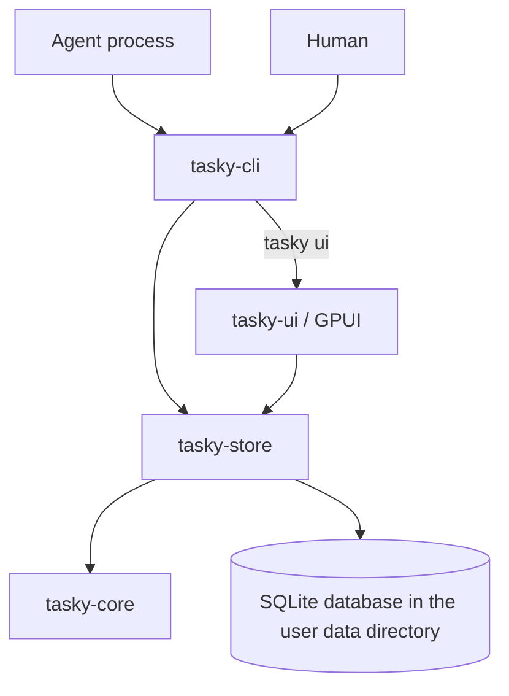
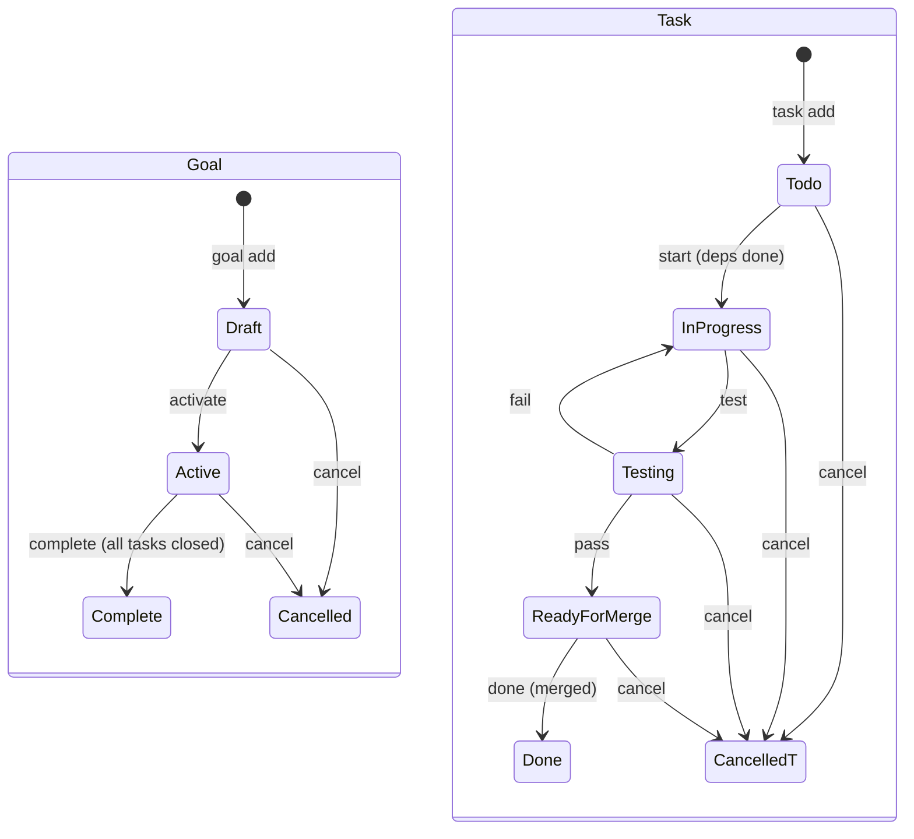

# Tasky architecture and implementation plan

## 1. Goal and initial scope

Build a durable task dependency graph that multiple agents can inspect and update
through a complete CLI. Provide a GPUI application for understanding current work,
blocked paths, and ownership. The graph is the source of truth; agent execution is
outside the initial product. A task may describe coding, research, or human work.

The workspace is a runnable vertical slice: a domain model of projects, goals,
and tasks; DAG rules in `tasky-core`; Diesel/SQLite persistence with embedded
migrations; a CLI covering every implemented operation; and a manually refreshed
GPUI task list. The milestones below describe future work unless explicitly marked
as present. We should stabilize behavior before expanding the transport or building
an autonomous executor.

## 2. Workspace boundaries

- **tasky-core** owns `Project`, `Goal`, `Task`, `Dependency`, `TaskLink`,
  their status enums, the `Dag` view, and domain errors. It is synchronous and
  deterministic, with no filesystem, network, GPUI, clock, or agent execution
  dependencies; callers pass the current time and generated IDs in. Mutations validate
  preconditions before changing state. Ordered collections make results reproducible.
- **tasky-store** owns the SQLite database through Diesel: initialization, embedded
  migrations, reference resolution, and one immediate transaction per mutation that
  loads rows, applies a core rule, and writes the result. Both clients use this
  boundary. Storage errors retain context without becoming domain policy.
- **tasky-cli** is the one binary and the first-class way to interact with Tasky. It
  translates arguments into store operations, owns stdout/stderr formatting and exit
  codes, and launches the viewer through `tasky ui`. No graph rule belongs here.
- **tasky-ui** is a library that renders a read model loaded from the store. It never
  edits data. Future UI mutations must use the same store operations as the CLI.

As commands acquire revisions, leases, and events, introduce **tasky-service**
between clients and storage. It will expose typed `Command` and `Query` enums,
transaction boundaries, injected time/ID sources, and structured results. Avoid an
empty abstraction now; extract the concrete workflow when a second writer client
or durable event requirement makes it useful. No dependency may point from the
core toward a client.

## 3. Model and invariants

### Present model

One database holds any number of **projects**, each with a unique slug, a name, and an
optional repository path and URL; a project is anything work is organized under, and only
coding projects tend to have a repository. A
**goal** belongs to a project and has a slug unique within that project, a title, a
description, an optional **spec** (free text describing the goal in detail), and a status
(`draft`, `active`, `complete`, `cancelled`). Every **task** belongs directly to a goal and
has a title, body, test plan (the validation steps that prove it complete), optional pull
request link, and status (`todo`, `in_progress`, `testing`, `ready_for_merge`, `done`,
`cancelled`). **Dependencies** are edges between any two tasks in the same project. **Links**
attach a commit SHA or URL to a task. IDs are ULIDs stored as text; timestamps are RFC 3339 UTC text.

`task depend A B` means **A requires B**. Stored adjacency points from dependent to
prerequisite. A task is ready iff it is todo and every dependency is done; cancelled
dependencies keep dependents blocked until the edge is removed, and a dependency that is
still testing or ready for merge blocks too. Readiness and blocking are derived, never
persisted.

A task moves along one path, `todo → in_progress ⇄ testing → ready_for_merge → done`.
Testing validates the work against the task's test plan; failing sends it back to in
progress. Ready for merge means validation passed and the pull request is waiting. Done
records the merge and is reachable only from ready for merge. Cancellation is allowed from
every open state.

The database enforces referential integrity, unique project slugs, per-project unique
goal slugs, status vocabularies, and the absence of self edges. Rust enforces everything
SQL cannot: acyclicity (checked before every insert, iteratively), edges only between tasks
of the same project, dependency edits only on todo tasks, starting only with done
dependencies, one step at a time along the task path, test plan and pull request edits only
on open tasks, spec and task changes only while the goal is draft or active, and
completion only when every task is done or cancelled.

Completing work is terminal; there is no reopening. Adding an existing dependency or
link, or removing a missing dependency, is a no-op. Every mutation runs in one SQLite
immediate transaction, so two cooperating processes cannot both start the same task.

### Planned extensions

Add labels, priority, assignees, result summaries, and artifact references as
migrations. Add task revisions for compare-and-swap updates and a project revision
for snapshot freshness. Decide whether a spec should gain versions or a frozen state
(currently it is plain editable text). Define cancellation and archival instead of
silently deleting evidence.
Hard deletion, if supported, must reject incoming dependencies unless an explicit
transactional cascade is requested. Never invalidate completed work silently.

For leases, persist owner, unique claim token, expiry, attempt number, and heartbeat.
Only the current token can finish or extend a claim. Inject a clock for tests.
Expired claims become eligible for explicit reclamation; a stale worker cannot
complete a reclaimed task. Retries record attempt history and optional backoff.
Define whether failure blocks descendants (initial policy: yes) and whether
cancellation propagates (initial proposal: explicit action, no hidden propagation).

## 4. Persistence and concurrent agents

### Present adapter

The store is one SQLite file shared by every project, `tasky/tasky.db` under
`$XDG_DATA_HOME` (falling back to `~/.local/share`) by default, accessed through Diesel with
the bundled SQLite library. `--db` or `TASKY_DB` selects another file. Migrations live in `crates/tasky-store/migrations` and are
embedded in the binary; `schema.rs` is maintained by hand to match them. Only `init`
and `migrate` change the schema. Opening a database with pending migrations fails and
names the fix, so a newer binary never rewrites the user's database as a side
effect of a read. Every connection enables foreign keys and a five-second busy timeout.
`init` refuses to overwrite an existing file.

Each mutation is one immediate transaction: resolve references, load the rows the rule
needs (for graph rules, every task and edge), apply the `tasky-core` operation, write the
result. SQLite's own locking replaces the previous advisory lock file. Edges never cross
projects, so the union of every project's tasks is still a DAG and one whole-graph load
serves every query. That is fine at the intended scale of roughly a hundred tasks per
project; scope the load per project if it ever is not.

Projects resolve by slug or by a unique prefix or suffix of an ID. Goals resolve as
`project/slug`, by a slug that only one project uses, or by an ID fragment. Tasks resolve
by ID fragment only. ULIDs start with a millisecond timestamp, so IDs created close
together share a long prefix; the random tail is what humans type.

### Relationship to repositories

Projects are not repositories. A coding project may record the repository it is tied to
as a local `repo_path`, a remote `repo_url`, or both, but the database lives outside every
repository and is never committed. Backup and export are project-lifecycle commands (below); a repository refers
to its work through task pull requests and links, not by carrying task state.

## 5. CLI as the complete automation surface

Every supported domain action must have a CLI operation before it can be considered
finished. The CLI exposes `init`, `migrate`, and the `project`, `goal`, and `task`
command groups; README specifies current arguments and output shapes. Mutations return
the affected record.

Evolve the CLI in these groups:

| Area | Planned commands / behavior |
| --- | --- |
| Project lifecycle | rename, archive, export/import, backup/restore, migration policy |
| Goals | edit titles/descriptions, spec history, reopen policy, deletion policy |
| Tasks | edit, label, priority, archive |
| Agent coordination | claim-next, heartbeat, release, reclaim, attempt history |
| Observation | project summary, event history, watch with NDJSON |

Before a stable release, define versioned response envelopes, typed error codes,
pagination/cursors, expected-revision flags, and idempotency keys for mutations.
Separate domain conflict, missing entity, bad input, and I/O failure exit codes.
Keep stdout exclusively parseable when `--json` is set, including parser failures;
the scaffold currently leaves syntax errors to Clap. Provide bounded noninteractive
commands without prompts, plus examples of safe claim/retry loops. A claim-next
command must select and claim under the same transaction, ordered by documented
priority and ID rules. Never implement it as `ready` followed by an unlocked write.

## 6. GPUI visualization

Use published GPUI 0.2.2, pinned in the UI manifest. The viewer is compiled into the
`tasky` binary and started with `tasky ui`, so one install covers both surfaces. The present viewer is a monochrome, pannable,
zoomable graph: a pure layout module (unit-tested without a display) places projects,
goals, and tasks in left-to-right columns by hierarchy and dependency rank, and a single
canvas paints circles, edges, and labels. Dependencies are optimized even in dev builds
so the viewer stays smooth without a release build. Startup failures are explicit.

Next, introduce a view model containing task summaries, edges, selection, filters,
and observed revision. Load on a background executor, deliver immutable snapshots
to the GPUI entity, then notify it. Coalesce changes and discard out-of-order
responses. Filesystem notifications are hints: debounce and reload, with polling
fallback. Preserve selection by task ID across refreshes.

Next, reduce edge crossings with barycentric sibling ordering, add a background
refresh, search, and a details view, and show state through shape and text rather than
color so the graph stays black and white. Virtualize large views and never recompute
layout on paint; layout runs once per snapshot today. Add editing only after typed service commands and stale-revision handling
exist, and expose the same action in CLI. Initially target Linux and macOS; validate
Windows separately before claiming support.

## 7. Build milestones and acceptance criteria

1. **Scaffold (present).** Four crates, pinned toolchain and lockfile, the
   project/goal/task model on SQLite, CLI JSON output, GPUI list, docs, and a CI
   template. Accept when tests and lint pass on Linux, and desktop source
   type-checks on a supported platform. Manually verify launch/refresh/scroll/close
   on a machine with a display before release.
2. **Domain and contract hardening.** Revisions, edit/archive, spec history,
   structured service commands, stable JSON/error schemas, events, export/import and
   backup/restore of the shared database. Accept when every action has a CLI command,
   rejected operations leave state unchanged, and checked-in examples match
   integration-test output.
3. **Reliable agent scheduling.** Leases, heartbeat/release/reclaim, claim-next,
   idempotency and attempt history. Accept with competing-process tests, controlled
   clock tests, stale-token rejection, and recovery after an agent dies mid-task.
4. **Live graph UI.** Background refresh, graph canvas, filters, details and keyboard
   navigation. Accept with stable layout tests and manual Linux/macOS checks that
   CLI mutations appear without restart and errors retain a labeled last good view.
5. **Release readiness.** CLI reference generated from help, example agent loop,
   platform packaging, migration policy and performance budgets. Benchmark chain,
   fan-in/fan-out and disconnected graphs at 1k/10k tasks before selecting targets.
   Publish a supported-platform matrix and recovery documentation.

Work milestone by milestone in small PRs. Each new behavior includes a core rule,
storage transaction if needed, CLI coverage, documentation, and UI representation
where relevant. A separate executor, remote API, MCP integration, auth, plugins,
and distributed scheduling are out of scope until the local contract is stable.

## 8. Validation strategy and risks

Present tests cover cycle rejection, missing endpoints, dependency-gated readiness,
the full task path including the testing loop and the rule that no state can be skipped,
test plan and pull request edits, goal lifecycle with an optional spec, slug and link validation,
per-project goal slugs and `project/slug` resolution including ambiguity, isolation
of dependencies and scopes between projects, concurrent connections racing to start a
task, and end-to-end CLI workflows including competing processes.
The CI template runs formatting, tests, and lints on Linux with GPUI build packages installed, plus a macOS Clippy check.
It must be copied from `ci/github-actions.yml.example` to `.github/workflows/ci.yml`
with workflow-authorized credentials before GitHub Actions will run it.

Add property tests that generate arbitrary DAGs and attempted mutations; after
success validate invariants, after rejection compare the full database. Add
corrupt-database fixtures and multi-process contention stress tests. Migration
tests must load old fixtures, upgrade, reopen, and preserve task identities and
dependency semantics.

GPUI compilation is not a visual test. A desktop smoke checklist must cover empty
and populated stores, long titles/reasons, many tasks, resize/scroll, refresh after
CLI edits, malformed data, missing files, and closing the last window. Later add
view-model and layout tests independent of a GPU, plus platform smoke jobs where
runners permit a real display.

Main risks: GPUI platform churn (pin and upgrade deliberately); one shared database
for every project (back it up, and keep schema upgrades explicit); stale workers
(claim tokens and leases);
contract drift (CLI fixtures and shared service layer); event/state divergence
(one transaction); and unclear dependency semantics (one documented direction and
core invariants). Keep agent-provided text as data and never execute it implicitly.
