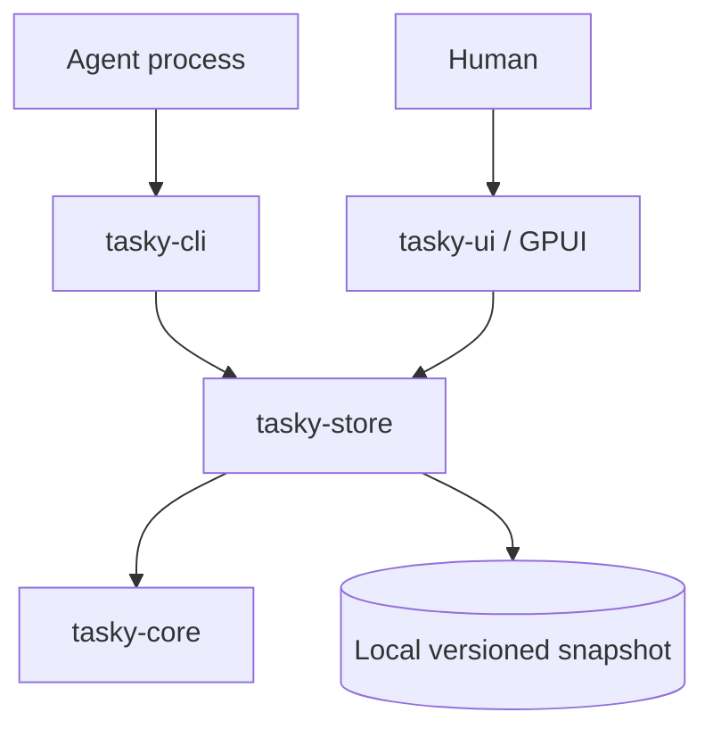
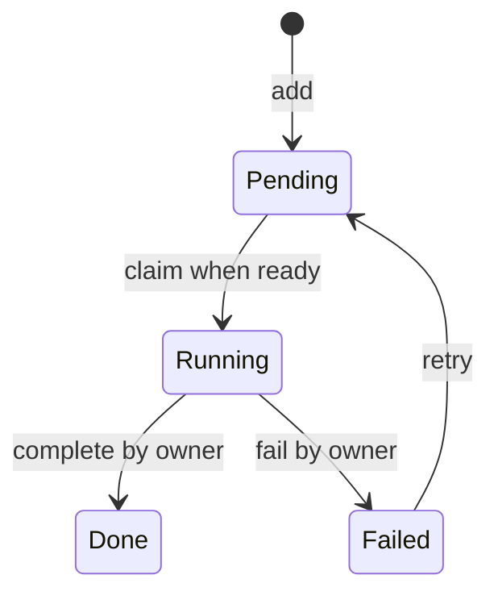

# Tasky architecture and implementation plan

## 1. Goal and initial scope

Build a durable task dependency graph that multiple agents can inspect and update
through a complete CLI. Provide a GPUI application for understanding current work,
blocked paths, and ownership. The graph is the source of truth; agent execution is
outside the initial product. A task may describe coding, research, or human work.

This PR establishes the workspace and a runnable vertical slice. It implements
local DAG rules, JSON persistence, explicit claims, CLI coverage of the implemented
operations, and a manually refreshed GPUI task list. The milestones below describe
future work unless explicitly marked as present. We should stabilize behavior
before expanding the transport or building an autonomous executor.

## 2. Workspace boundaries

- **tasky-core** owns `Graph`, `Task`, `Status`, and domain errors. It is synchronous
  and deterministic, with no filesystem, network, GPUI, clock, or agent execution
  dependencies. Mutations validate preconditions before changing state. Ordered
  collections make snapshots and query results reproducible.
- **tasky-store** owns load, initialize, and locked read-modify-write transactions.
  Both clients use this boundary. It validates snapshots after reading and before
  saving. Storage errors retain context without becoming domain policy.
- **tasky-cli** translates arguments into core operations within store transactions.
  It owns stdout/stderr formatting and exit codes. No graph rule belongs here.
- **tasky-ui** renders a read model and refreshes it from the store. It never edits
  JSON directly. Future UI mutations must use the same application commands as CLI.

As commands acquire revisions, leases, and events, introduce **tasky-service**
between clients and storage. It will expose typed `Command` and `Query` enums,
transaction boundaries, injected time/ID sources, and structured results. Avoid an
empty abstraction now; extract the concrete workflow when a second writer client
or durable event requirement makes it useful. No dependency may point from the
core toward a client.

## 3. Model and invariants

### Present model

A graph has `schema_version: 1` and a map of tasks keyed by caller-chosen string ID.
Each task has `id`, nonblank `title`, a set of dependency IDs, and a tagged status:
`pending`, `running { agent }`, `done`, or `failed { reason }`.

`depend A B` means **A requires B**. Stored adjacency points from dependent to
prerequisite. A future canvas should draw execution-flow arrows B → A and label
that convention. A task is ready iff it is pending and every dependency is done.
Readiness and blocking are derived, never independently persisted.

Enforce unique nonblank IDs; matching map keys and task IDs; existing dependency
endpoints; no self-edges or cycles; nonblank titles, owners, and failure reasons;
and done prerequisites for every task that has started. Adding A → B checks
whether B already reaches A before insertion. Traversal is iterative to avoid
recursive stack overflow. Duplicate edge adds and absent edge removals are no-ops
when both endpoints exist and the dependent is pending.

Dependency changes are allowed only on pending tasks. Completing work is terminal;
there is no reopening done tasks that could invalidate downstream completion.
Retry does not automatically claim the task. An owner name is a coordination
convention, not proof of identity. Claim is a single locked transaction so two
cooperating processes cannot both win. A crashed agent currently leaves work
running; recovery is an explicit future milestone, not an implicit timeout.

### Planned extensions

Add descriptions, labels, priority, creation/update times, result summaries, and
artifact references after versioned migration support. Prefer opaque generated
IDs with optional caller-specified IDs, and keep identity separate from titles.
Add task revisions for compare-and-swap updates and graph revisions for snapshot
freshness. Define cancellation and archival instead of silently deleting evidence.
Hard deletion, if supported, must reject incoming dependencies unless an explicit
transactional cascade is requested. Never invalidate completed work silently.

For leases, persist owner, unique claim token, expiry, attempt number, and heartbeat.
Only the current token can finish or extend a claim. Inject a clock for tests.
Expired claims become eligible for explicit reclamation; a stale worker cannot
complete a reclaimed task. Retries record attempt history and optional backoff.
Define whether failure blocks descendants (initial policy: yes) and whether
cancellation propagates (initial proposal: explicit action, no hidden propagation).

## 4. Persistence and concurrent agents

### Present adapter

Each store directory contains `graph.json` and a persistent `graph.lock` file.
A mutation takes an exclusive advisory lock, reloads and validates current state,
applies the operation, validates again, writes a temporary file in the same
directory, flushes it, and atomically replaces the snapshot. Unix additionally
syncs the directory. Dropping the lock handle releases the lock on success or
error. Failed operations before replacement leave the previous snapshot intact.
Readers see an old or new complete snapshot without locking. Initialization takes
the same lock and refuses an existing snapshot. Never delete or replace the lock
file while processes are using the store.

This is for small local graphs and cooperating processes. It is not a distributed
lock or a network-filesystem protocol. If a sync or output error occurs after the
replacement, a command can report failure even though its mutation committed;
agents must inspect state before retrying. Request IDs and deduplication will
resolve this ambiguity later. Atomic replacement does not itself provide backups.

### Next adapter

Move to SQLite when indexed queries, events, leases, or larger graphs justify it.
Keep core rules independent of SQL. Use foreign keys, a migration table, short
transactions and a bounded busy timeout. Claim selection and transition must
happen in one transaction. Store task updates and their append-only domain events
in the same commit. Candidate tables: `graphs`, `tasks`, `dependencies`, `attempts`,
`events`, and `requests` (idempotency keys). Establish backup and restore commands
before making schema upgrades automatic.

Build a validated importer for v1 snapshots, then compare imported readiness and
status against the old adapter with shared conformance tests. Preserve the old
file until verification succeeds. Unsupported versions must fail with a useful
message, never reset the graph. SQLite remains single-host initially; a server
transport is a separate decision driven by actual multi-host requirements.

## 5. CLI as the complete automation surface

Every supported domain action must have a CLI operation before it can be considered
finished. The scaffold exposes init, add, list, show, depend, undepend, ready,
claim, complete, fail, retry, snapshot, and validate; README specifies current
arguments and output shapes. Mutations currently return the full snapshot.

Evolve the CLI in these groups:

| Area | Planned commands / behavior |
| --- | --- |
| Graph lifecycle | import/export, backup/restore, migrate |
| Tasks | edit, label, filter, cancel, archive; deliberate deletion policy |
| Dependencies | list blockers/dependents, explain readiness, topological order |
| Agent coordination | claim-next, heartbeat, release, reclaim, attempt history |
| Observation | graph summary, event history, watch with NDJSON |

Before a stable release, define versioned response envelopes, typed error codes,
pagination/cursors, expected-revision flags, and idempotency keys for mutations.
Separate domain conflict, missing entity, bad input, and I/O failure exit codes.
Keep stdout exclusively parseable when `--json` is set, including parser failures;
the scaffold currently leaves syntax errors to Clap. Provide bounded noninteractive
commands without prompts, plus examples of safe claim/retry loops. A claim-next
command must select and claim under the same transaction, ordered by documented
priority and ID rules. Never implement it as `ready` followed by an unlocked write.

## 6. GPUI visualization

Use published GPUI 0.2.2, pinned in the UI manifest, with native dependencies
isolated from default headless builds. Start with the existing list showing IDs,
titles, state, owners/reasons, and dependencies. Startup failures are explicit;
refresh failures retain the last good view and mark it as stale.

Next, introduce a view model containing task summaries, edges, selection, filters,
and observed revision. Load on a background executor, deliver immutable snapshots
to the GPUI entity, then notify it. Coalesce changes and discard out-of-order
responses. Filesystem notifications are hints: debounce and reload, with polling
fallback. Preserve selection by task ID across refreshes.

Build a layered DAG layout using topological ranks, stable sibling ordering, and
separate layout coordinates from domain data. Render prerequisite-to-dependent
edges, state badges, a legend, pan/zoom, search, and a details panel. Show blockers
and ownership as text as well as color. Retain the list as a keyboard-friendly
alternative; virtualize large views. Do not recompute expensive layout on every
paint. Add editing only after typed service commands and stale-revision handling
exist, and expose the same action in CLI. Initially target Linux and macOS; validate
Windows separately before claiming support.

## 7. Build milestones and acceptance criteria

1. **Scaffold (this PR).** Four crates, pinned toolchain and lockfile, local graph
   workflow, CLI JSON output, GPUI list, docs, and a CI template. Accept when headless tests and
   lint pass, and desktop source type-checks on a supported platform. Manually
   verify launch/refresh/scroll/close on a machine with a display before release.
2. **Domain and contract hardening.** Typed IDs, revisions, edit/cancel/archive,
   descriptions/results, structured service commands, stable JSON/error schemas.
   Accept when every action has a CLI command, rejected operations leave state
   unchanged, and checked-in examples match integration-test output.
3. **Durable history.** SQLite repository, schema migrations, events, backup and
   v1 importer. Accept with crash/rollback tests, adapter conformance tests, and
   restore verification; no silent data loss or partial import.
4. **Reliable agent scheduling.** Leases, heartbeat/release/reclaim, claim-next,
   idempotency and attempt history. Accept with competing-process tests, controlled
   clock tests, stale-token rejection, and recovery after an agent dies mid-task.
5. **Live graph UI.** Background refresh, graph canvas, filters, details and keyboard
   navigation. Accept with stable layout tests and manual Linux/macOS checks that
   CLI mutations appear without restart and errors retain a labeled last good view.
6. **Release readiness.** CLI reference generated from help, example agent loop,
   platform packaging, migration policy and performance budgets. Benchmark chain,
   fan-in/fan-out and disconnected graphs at 1k/10k tasks before selecting targets.
   Publish a supported-platform matrix and recovery documentation.

Work milestone by milestone in small PRs. Each new behavior includes a core rule,
storage transaction if needed, CLI coverage, documentation, and UI representation
where relevant. A separate executor, remote API, MCP integration, auth, plugins,
and distributed scheduling are out of scope until the local contract is stable.

## 8. Validation strategy and risks

Present tests cover cycle rejection, missing endpoints, dependency-gated readiness,
owner checks, failure/retry, snapshot rollback, unsupported schema, concurrent
writers, and end-to-end CLI workflows including competing process claims.
The CI template runs formatting, headless tests/lints, and a macOS UI check.
It must be copied from `ci/github-actions.yml.example` to `.github/workflows/ci.yml`
with workflow-authorized credentials before GitHub Actions will run it.

Add property tests that generate arbitrary DAGs and attempted mutations; after
success validate invariants, after rejection compare the full snapshot. Add
fault injection around write/rename/sync, corrupt/truncated snapshot fixtures,
and multi-process contention stress tests. Migration tests must load old fixtures,
upgrade, reopen, and preserve task identities and dependency semantics.

GPUI compilation is not a visual test. A desktop smoke checklist must cover empty
and populated stores, long titles/reasons, many tasks, resize/scroll, refresh after
CLI edits, malformed data, missing files, and closing the last window. Later add
view-model and layout tests independent of a GPU, plus platform smoke jobs where
runners permit a real display.

Main risks: GPUI platform churn (pin and upgrade deliberately); whole-snapshot cost
(benchmark before SQLite migration); stale workers (claim tokens and leases);
contract drift (CLI fixtures and shared service layer); event/state divergence
(one transaction); and unclear dependency semantics (one documented direction and
core invariants). Keep agent-provided text as data and never execute it implicitly.
